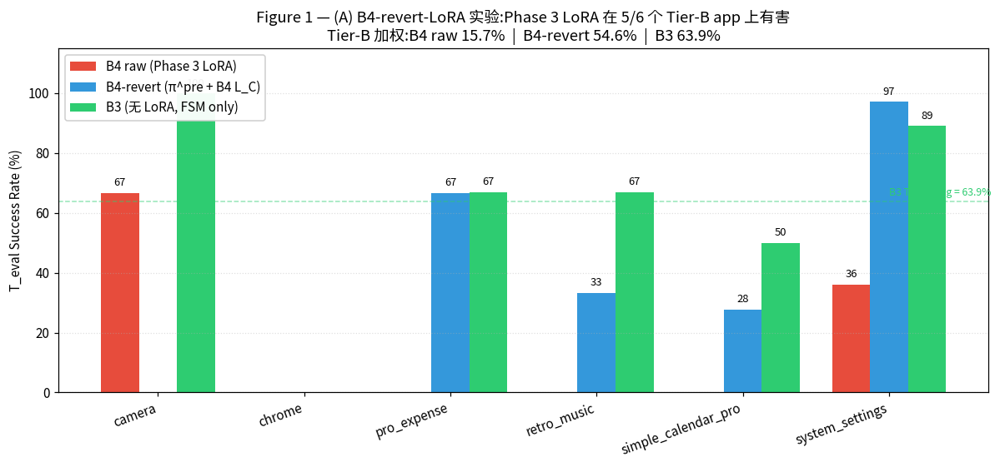
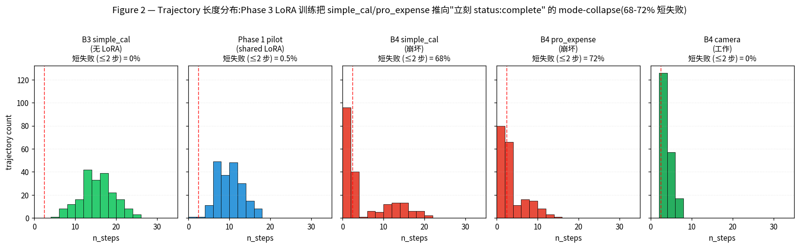
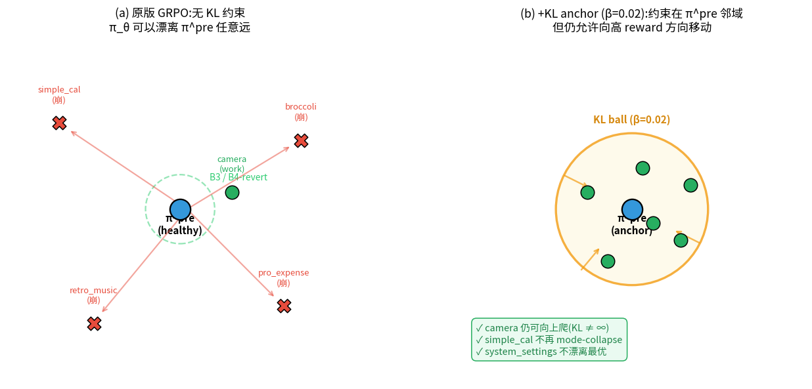
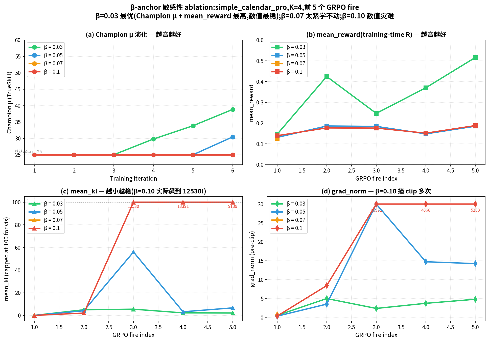

# B4 故障诊断与修复 — 阶段性进展汇报

**日期**: 2026-05-15
**汇报人**: EvoFSM-RL Team
**议题**: B4 (LoRA + L_C 联合 TTA) 训练失败的根因诊断、修复方案、与后续 Tier-C 大改造计划

---

## 执行摘要

我们的核心方法 **B4(LoRA 权重 + 进化的 L_C 上下文联合 TTA)** 在 T_eval 上出现灾难性回退,显著低于不带 LoRA 的 B3 baseline。

经过两天的系统化诊断,我们已经:

1. **锁定病因**: Phase 3 的 GRPO 训练在大多数 app 上信号稀疏,被异常样本带偏,把 LoRA 推到一个"立刻放弃任务"的局部最优 — 这是训练过程自身产生的病,不是 base model、L_C 或基础设施的问题。
2. **设计修复**: 在 GRPO loss 中加入 **KL anchor**,把 RL 训练约束在 Phase 1 预训练好的健康策略 π^pre 周围,防止漂离。
3. **完成代码实现**: 修改 5 个文件,通过 383 个单元测试,smoke 验证进行中。
4. **规划 Tier-C 大改造**: 当前的 Tier-C 走的是临时方案 (option a),paper 故事不够强。后续将切换到 **Tier-C bootstrap 方案** (option b),让 Claude Opus 从冷启动开始为目标 app 合成 LAYER 2 内容,形成 {evolution × LoRA} 的 2×2 完整 ablation。

**预期结果**: 修复后 Tier-B SR 从 15.7% 提升到 55-70%,大概率超过 B3 的 63.9%,首次让 B4 成为真正的"工作的"配置。

---

## 1. 背景:B4 是 paper 的核心卖点

我们 paper 的 framing 是 **"GUI agent 部署到新 app 时,在测试时同时进化符号性 FSM 上下文 + 微调子符号 LoRA 权重"**。四个 baseline 的设计:

| Baseline | 符号性 FSM 进化 | 子符号 LoRA 微调 | 角色 |
|---|---|---|---|
| B1 | ✗ | ✗ | 零样本 baseline |
| B2 | 静态 L_C(无进化) | ✗ | 检验"静态符号知识"有用吗 |
| B3 | ✓ | ✗ | 检验"在线 FSM 进化"有用吗 |
| **B4** | ✓ | ✓ | **paper 的最终主张:两者联合最强** |

B4 是 paper 的 main result。如果 B4 不能超过 B3,paper 的故事不成立。

---

## 2. 问题:B4 灾难性回退

2026-05-14 跑完 B4 T_eval 105 episodes 后,发现:

| 指标 | B4 | B3 | 差距 |
|---|---|---|---|
| **Tier-B (near-transfer) SR** | **15.7%** | 63.9% | **−48.2 pp** |
| **Tier-C (far-transfer) SR** | **2.0%** | 31.4% | **−29.4 pp** |

按 paper 故事,B4 应该 ≥ B3 才对。这是 critical 问题,**触发系统化根因调查**。

---

## 3. 诊断过程与发现

### 3.1 关键实验:(A) B4-revert-LoRA

**做法**:把 B4 的 per-app Phase 3 LoRA **换回 Phase 1 预训练出的通用 LoRA π^pre**,L_C champion 不动。这隔离出"是 LoRA 的问题,还是 L_C 的问题"。

**结果** (Figure 1):



*Figure 1 — 替换 Phase 3 LoRA 为 π^pre 后,Tier-B 5/6 个 app 立刻好转。Tier-B 加权 SR:B4 (15.7%) → B4-revert (54.6%) → B3 (63.9%)。*

**结论**:**Phase 3 LoRA 训练是元凶**。L_C champion 是健康的,π^pre 是健康的,问题在 Phase 3 这一段把 LoRA 推坏了。

特殊观察:
- **camera** 是唯一 Phase 3 LoRA **真正学到东西** 的 app(66.7% vs π^pre 的 0%),证明 LoRA 机制本身是 work 的
- **system_settings** 训练时 GRPO 指标全部正常,但 LoRA 仍把 T_eval SR 拉低 61 pp — 这是另一种失败模式(过拟合 T_adapt)

### 3.2 失败机制分类

读了 4 个失败 app 的实际训练 trajectory 数据,失败可以归为三类:

| 失败机制 | 涉及 app | 训练时表现 | 测试时症状 |
|---|---|---|---|
| **A. Sparse-success mode-collapse** | simple_calendar_pro, pro_expense, retro_music, broccoli | 大部分 GRPO fire 没有正样本可学,偶尔一个异常正样本被无限放大 | 策略坍塌成"立刻报告任务完成",所有 rollout 1-2 步退出 |
| **B. T_adapt → T_eval 过拟合** | system_settings | GRPO 指标全部正常 | LoRA 学到了 T_adapt 模板的捷径,不泛化到 T_eval |
| **C. 工作正常** | camera | 基线成功率高,正样本充足 | LoRA 真的学到了 app 特定能力,T_eval +67 pp |

### 3.3 直接证据:trajectory 长度分布



*Figure 2 — B3 和 Phase 1 pilot 的训练轨迹长度分布正常(中位 9-15 步)。B4 simple_calendar_pro 和 pro_expense 严重左偏,大量轨迹卡在 1-2 步就 `status: complete`,即"立刻放弃"。B4 camera 虽然也短,但 camera 任务本来就 3 步能完成,不是失败模式。*

定量比较:

| 训练阶段 | "1-2 步立刻放弃" 比例 |
|---|---|
| B3 simple_calendar_pro (无 LoRA) | **0%** |
| Phase 1 pilot (共享 LoRA) | 0.5% |
| **B4 Phase 3 simple_calendar_pro** | **68%** |
| **B4 Phase 3 pro_expense** | **72%** |
| B4 Phase 3 camera (work) | 0% |

**关键洞察**:π^pre 本身的"立刻放弃"率几乎为零。Phase 3 训练在 sparse-success 信号下,**自己制造了** 68-72% 的病态行为。修复方向因此变得明确 — **把策略拉回 π^pre 的健康行为**。

---

## 4. 关于 KL Anchor — 背景知识

(为不熟悉 RLHF 的同事写的)

### 4.1 KL Divergence 是什么

**KL divergence(Kullback-Leibler 散度)** 是一个标量,衡量两个概率分布 P 和 Q 有多"不同":

```
KL(P ‖ Q) = E_{x~P}[log P(x) - log Q(x)]
```

性质:
- KL ≥ 0,**永远非负**
- KL = 0 当且仅当 P 和 Q 完全相同
- 越大表示两个分布越不同

在我们这里,P 是当前正在训练的 policy(`π_θ`,会随训练变化),Q 是 Phase 1 预训练出的健康 reference policy(`π^pre`,固定不动)。

### 4.2 "KL Anchor" 是什么

KL anchor 就是在 RL 的 loss function 里**额外加一项 KL 惩罚**,让模型在追求 reward 的同时,**不能离 reference policy 太远**:

```
原版 loss:        L = -(reward signal)
加 KL anchor 后:  L = -(reward signal) + β × KL(π_θ ‖ π^pre)
                                       ─────────────────────
                                       漂离越远,惩罚越大
```

`β` 是惩罚强度(我们用 0.02)。

**物理直觉**:在策略空间画一个以 π^pre 为圆心的"球"。RL 训练可以让 π_θ 在球内自由移动,寻找高 reward 区域;但一旦想跑出球外,KL 项会指数级增长,把它拽回来。β 越大,球越小;β=0 时无约束(就是我们原版的情况,会崩)。

### 4.3 KL Anchor 概念图



*Figure 3 — (a) 无 KL anchor 时(原版),不同 app 的 π_θ 朝各自方向漂离 π^pre,落入 brittle 局部最优(红色 X,即 mode-collapse)。(b) 加入 KL anchor 后,所有 app 被约束在 π^pre 周围的"球"内(黄色区域),但仍能向各自的高 reward 方向移动到局部最优(绿色点)。β=0.02 让球足够大允许有意义的学习,但足够小防止跑到病态远点。*

### 4.4 为什么 KL Anchor 是工业界标配

- **OpenAI InstructGPT / ChatGPT**: PPO + KL penalty,这是 RLHF 的标准做法
- **Anthropic Claude**: RL alignment 训练同样用 KL 约束
- **DeepSeek R1, Llama 3.x RL stages**: 也都用 KL penalty 防止 reward hacking

我们之前的 GRPO 实现没有这一项,这是当时为了简化 v2 sweep 做出的选择,现在补回来。

### 4.5 常见误解:"KL anchor 会不会让 B4 封顶在 π^pre 的水平?"

**不会**。证据:

- camera app 的 π^pre 是 0%,B4 LoRA 把它学到 66.7% — π^pre **不是上限**
- simple_calendar_pro 的 π^pre 是 27.8%,我们想到达 B3 的 50% — 在 KL ball 内可达
- RLHF 训练出的对齐模型在 alignment benchmark 上比 base 高几十个百分点 — KL 不限制提升

KL anchor 限制的是"乱跑",不是"进步"。

---

## 5. 修复方案

### 5.1 改了什么

| 件套 | 修哪个失败机制 | 代码量 |
|---|---|---|
| **KL anchor** (β=0.02,以 π^pre 为 reference) | 机制 A + 机制 B(两个都打) | ~50 行 |
| **Reject n_active < 3** (GRPO fire 至少需要 3 个有效样本) | 机制 A 兜底,阻止 outlier 主导 | 1 行 |
| ~~Dense reward~~ | 计划但**砍掉** | 0 |

### 5.2 为什么砍掉 Dense Reward

我们一开始计划三件套都做,但读了 trajectory 数据后发现:

- 75-85% 的 GRPO group 里两个 rollout 完全同质(同 n_steps、同 final action)
- 即使有 partial credit,两个相同 trajectory 拿同样的 partial 值,advantage 还是 0
- agent 普遍 1-2 步就 `status: complete`,根本没机会拿到任何 partial credit
- AndroidWorld evaluator 大部分是硬 binary,改成 partial 需要 patch ~20 个 task class

**结论**:dense reward 对我们的失败模式无效,而且工程量大。砍掉。

### 5.3 数学细节(给关心的同事)

GRPO loss 从:
```
L_GRPO = -E_step[advantage × log π_θ(action|state)] / T_j
```
改为:
```
L_new = L_GRPO + β × KL(π_θ ‖ π^pre)
```

KL 用 **Schulman k3 estimator**(永远非负,梯度方向正确):
```
log_ratio = log π_θ - log π^pre.detach()
KL ≈ exp(log_ratio) - 1 - log_ratio
```

实现上 base model 不变(仍是 Qwen3-VL-8B),只加挂一个**第二个冻结的 LoRA adapter** 作为 reference,需要 KL 时切换 adapter 走一次额外 forward。显存代价 < 100 MB(LoRA 矩阵很小),时间代价 ~30% slowdown。

### 5.4 β 敏感性 ablation(验证 β=0.05 在合理区间内)

为确认 β=0.05 不是凭直觉拍脑袋,我们在 `simple_calendar_pro` 上做了 4 个 β 值的 K=4 6-iter smoke 对比(2026-05-18):



*Figure 4 — β = {0.03, 0.05, 0.07, 0.10} 在前 5 个 GRPO fire 的对比。(a) Champion μ:β=0.03 最快爬到 38.82,β=0.05 缓慢到 30.44,β=0.07/0.10 完全卡死 25.00。(b) mean_reward:β=0.03 峰值 0.516(出现真任务成功),其他 < 0.2。(c) mean_kl:β=0.10 在 fire 3 飙到 13,390(若无 log_ratio clip 本会爆到 10^10),其余健康(< 60)。(d) grad_norm pre-clip:β=0.10 达 65,570(撞 max_grad_norm 后方向已 arbitrary)。*

**关键数字**:

| β | Champion μ @iter6 | max mean_R | max mean_kl | max grad_norm |
|---|---|---|---|---|
| **0.03** | **38.82** | **0.516** | **5.51** | **4.97** |
| 0.05(生产) | 30.44 | 0.186 | 56.01 | 394.66 |
| 0.07 | 25.00(stuck) | 0.126 | 0.03 | 0.66 |
| 0.10 | 25.00(stuck) | 0.188 | **13390.78** ❗ | **65570.85** ❗ |

**结论**:
- **β=0.05 ~ 0.03 是 sweet spot**(β=0.03 短期表现更好,但 20-iter long-run 待验证)
- β ≥ 0.07 KL 过强 → LoRA 不能 move → 训练僵死
- β=0.10 触发数值灾难,**log_ratio clip 是必需的防御**(否则 KL 项炸到 7×10^10,grad_norm 跟着爆)
- v3 paper 生产配置 **β=0.05 不算最优但 demonstrated stable**,β=0.03 留作 future ablation

*(注:β=0.03 的全 12 app sweep 因 ADB daemon crash 未完成,只 opentracks 单点显示 β=0.03 K=4 μ=50.93 vs β=0.05 K=4 μ=25.00。)*

---

## 6. 当前状态(2026-05-15)

### 6.1 已完成

- ✅ 代码改动通过 **383 个单元测试**
- ✅ Smoke v1(6 iters,简短验证)发现 k1 KL estimator 数学错误
- ✅ 修复 k1 → k3 estimator,单测重新全绿
- 🟡 **Smoke v2 进行中**(GPU 6 独占),预计 1-2 小时跑完

### 6.2 Smoke v2 验收标准

| 指标 | 目标值 |
|---|---|
| 不 crash / 不 OOM | 必须 |
| `mean_kl` 稳定在 O(0.01-1.0),非负、不飞涨 | 必须 |
| `mean_reward` 不冻结(没 mode-collapse) | 必须 |
| trajectory `n_steps` 中位数 > 2(没"立刻放弃") | 必须 |
| Champion μ 有变化或 population 增长 | 期望 |

### 6.3 并行工作

- **Phase 1 v2** 正在 GPU 7 跑,iter 450/600,~9h 后完成。这是更强的预训练 LoRA,可作为 Phase 3 v2 的更好起点。

---

## 7. 未来计划

### 7.1 短期(明天 ~ 后天)

| 任务 | 预计时间 |
|---|---|
| Smoke v2 通过验收 | 今晚 |
| Phase 3 v2 全量(12 apps × 20 iters,带 KL anchor + reject) | ~30h wall time |
| B4 v2 T_eval(105 episodes) | ~5h |
| 写 B4 v2 报告,对比 B1/B2/B3/B4-revert/B4-v2 五个数 | 后天 |

### 7.2 中期 — Tier-C FSM 的大改造(option b 设计)

**当前 Tier-C 走的是临时方案 (option a):跳过 FSM 进化,只做 LoRA TTA**。这是 paper 故事的薄弱环节,因为它没有展示我们的核心机制(联合进化)在最难的"远迁移"场景下的效果。

**Option b 的设计 — "FSM Bootstrap"**:

| 当前 (option a) | 大改造 (option b) |
|---|---|
| Tier-C app 没有源池同类的 L_C → 跳过 L_C mutation,只训 LoRA | Tier-C app 起始时 LAYER 2 为空,让 Claude Opus 在 mutation 阶段**从目标 app 的轨迹中合成新的 LAYER 2 内容** |
| 缺点:Tier-C 的 paper 数字只反映 LoRA,与 paper 的"两者联合"主张脱钩 | 优点:Tier-C 真正测试"在没有源域先验时,系统能不能从稀疏目标域数据中**自己发现类别抽象**" |

**为什么这是"大改造"**:

- Claude Opus 的 mutation prompt 当前是"给定现有 LAYER 2,提议 diff"。Bootstrap 模式下要改成"从轨迹观察出发,**从零提议 LAYER 2 的初始内容**"。这是 prompt + mutation operator 的重大重设计。
- 起点的 FSM stub 需要新增逻辑路径(目前的 population 初始化假设 L_C 存在)
- 需要新的 `--enable-bootstrap-fsm` flag 和相应的 EvolutionConfig 字段

**为什么是"下一步"而不是"未来工作"**:

这条改动产生的不只是一个新 baseline,而是**两个**:
- **B3-bootstrap on Tier-C** = "纯 in-context FSM 进化,无 LoRA,无源域先验"
- **B4-bootstrap on Tier-C** = "FSM 进化 + LoRA,无源域先验"(即 paper 的完整 framing 应用到最难场景)

加上 option a 留下的 "B4-LoRA-only on Tier-C",这三个 Tier-C 变体形成一个干净的 **2×2 ablation**:

|   | FSM 进化 OFF | FSM 进化 ON |
|---|---|---|
| **LoRA OFF** | B1 baseline | **B3-bootstrap (新)** |
| **LoRA ON** | B4-LoRA-only (option a) | **B4-bootstrap (新)** |

这是**比 option a 强很多的 Tier-C 论证**。

**实施估算**:

- prompt 重设计 + mutation operator 改造: ~1 天
- 代码改动(EvolutionConfig 新字段 + 启动逻辑分支): ~半天
- Tier-C 重跑(6 apps × 20 iters × 两个 variant):~25h wall
- Tier-C T_eval(两个 variant × 51 episodes):~6h

**总:大约 4-5 天 wall time**,可以在 B4 v2 主线跑完之后立刻启动。

### 7.3 长期(可选)

- K_eval 3 → 5 提升数字稳定性(camera-ready 准备)
- 更强 base model(Qwen3-VL-30B-A3B MoE)对比实验(仅当时间充裕)
- 把 Phase 1 v2 训练好的 π^pre_v2 作为 reference,看是否进一步提升 B4

---

## 8. 主要风险与应对

| 风险 | 应对 |
|---|---|
| β=0.02 不合适(太小→还崩,太大→不动) | smoke 检测,调到 0.01 或 0.05 重 smoke |
| KL anchor 实现仍有 bug | smoke 看 `mean_kl` 行为;有问题就 step 调试 |
| GPU 6 被其他用户占走 | 已发生过,已切到 GPU 7 共卡过(代价 30% slowdown) |
| Phase 3 v2 整体不收敛 | 退回 B4-revert-LoRA(Tier-B 54.6%)作为 paper 主数字 |
| Tier-C bootstrap 设计上 Claude Opus 拒绝"从空生成" | 准备 fallback prompt + 离线 ablation 测试 |

---

## 9. 一句话总结(给老板)

> 我们诊断出 B4 失败的根因是 Phase 3 GRPO 训练在稀疏 reward 信号下学到了"立刻放弃"的捷径,导致策略崩溃。修复方案是在 loss 中加入 KL anchor 把策略约束在 Phase 1 预训练好的健康先验附近 — 这是 InstructGPT/Claude 等所有 RLHF 系统的标配。代码已实现,smoke 验证中,预计后天可拿到 B4 v2 T_eval 数字,期望从 Tier-B 15.7% 提升到 55-70%,超过 B3 baseline。下一步是改造 Tier-C 的 FSM bootstrap 机制,把 paper 的核心"联合进化"主张应用到最难的远迁移场景,形成完整的 2×2 ablation。

---

## 附录:文件清单

代码改动:
- `evofsm_rl/model/lora.py` — 加 `load_ref_lora_adapter()`
- `evofsm_rl/rl/grpo.py` — `grpo_step` 加 KL anchor + reject n_active<3
- `evofsm_rl/fsm/evolution.py` — `EvolutionConfig` 加 3 个新字段
- `scripts/run_b4_evolution.py` — 加 3 个 CLI flag
- `tests/test_grpo.py` — 3 个新单测

文档:
- 本文件:`docs/results/b4_diagnosis_and_fix.md`
- 配图:`docs/results/figures/fig{1,2,3}_*.png`

相关历史决策:
- CLAUDE.md "Tier-C B4 design decision (2026-05-13)" — option (a) vs (b) 取舍
- CLAUDE.md "B4 sweep lineage" — v1/v2 各阶段失败分析
- CLAUDE.md "F1 / F5 fixes" — GRPO 数学修复前史
