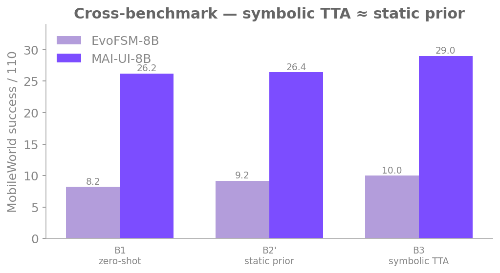

# Cross-benchmark (MobileWorld)

The hardest generalization test in EvoFSM: pretrain on one benchmark, deploy on a
**separately authored** one. The symbolic prior (`L_C` + per-app FSM Layer-2)
learned on AndroidWorld+ has to transfer across an environment boundary — new
apps, a new harness, a new agent format — by Play-Store category alone.

## Setup

- **Train → test** — pretrain on **AndroidWorld+** (193 tasks); evaluate on
  **MobileWorld GUI-only**, a 110-task eval split (`T_eval`).
- **Pure vision** — no accessibility tree. The agent sees only screenshots and
  acts in MobileWorld's native `mobile_use` format. The FSM/`L_C` prior is
  spliced into the system prompt as text.
- **Two models** span the capability range:
    - **EvoFSM-8B** (Qwen3-VL-8B-Instruct) — a *weak base* on this benchmark,
      ~8% zero-shot.
    - **MAI-UI-8B** — MobileWorld's own *first-party* GUI agent, a
      **near-ceiling** external baseline native to the benchmark (~26% zero-shot).
- **Variance** — every configuration is run **5×110 tasks**; we report
  `mean ± std`. Containers are created **fresh per run and never reused**
  (MobileWorld does not reset app state between tasks), so concurrency affects
  only wall-clock.
- **Denominator** — fixed at 110. Two tasks (`CheckMeetingEventAskUserTask`,
  `ThanksgivingPrepTask`) fail to initialize on every run from the same upstream
  harness bug (model-independent), so scores are effectively out of 108.

The ladder mirrors the within-benchmark study: **B1** zero-shot → **B2** static
symbolic prior → **B3** symbolic test-time evolution → **B4** joint symbolic +
weight adaptation.

## B1–B3 on two models

Success out of 110, 5-run `mean ± std`. **B2′** is the best static configuration
(app Layer-2 + category `L_C`, no Layer-1 — see findings below); the B3 column is
the **lessons-only** symbolic-evolution variant, the reportable positive.

{ width="620" }

| Model | B1 (zero-shot) | B2′ (static prior) | B3 (lessons-only) |
|---|---|---|---|
| **EvoFSM-8B** (weak base) | 8.2 ± 0.8 | 9.2 ± 1.6 | **10.0 ± 1.4** |
| **MAI-UI-8B** (near-ceiling) | 26.2 ± 2.4 | 26.4 ± 2.0 | **29.0 ± 4.5** |

MAI-UI is ~3.2× the EvoFSM-8B base — a far stronger GUI agent on its home
benchmark, with the widest gap on Tier-A multi-app composition. Both B3 numbers
are *nominally* the highest in their row but, given the error bars, overlap the
static prior heavily.

## Key findings

### 1. The static-injection benefit is capability-dependent

The same B2′ prior helps the weak model and does essentially nothing for the
strong one:

| Model | B2′ − B1 |
|---|---|
| EvoFSM-8B | **+1.0** (~1σ) |
| MAI-UI-8B | **+0.2** (within noise) |

The B2′ guidance was mined from **EvoFSM-8B's** weaknesses — the
read-before-acting / verify-before-terminate discipline it lacks. MAI-UI already
has that workflow knowledge internally, so injection adds nothing and can even
push it off its own (better) policy. On MAI, every large attributable task flip
under B2′ is a *regression*, cancelled by scattered sub-threshold gains for a
flat total: the **over-specification** failure mode.

### 2. Cross-benchmark Layer-1 injection is strictly harmful

Injecting the source-environment **Layer-1** of the FSM (concrete states /
transitions / visual cues) is harmful on *every* run, so the best static config
drops it entirely:

- **B2′ = app Layer-2 + category `L_C`** is the best static configuration. It is
  the only EvoFSM-8B config above baseline and is the variant transferred to
  MAI-UI.
- The damage is **deterministic and mechanistic**, not statistical. On the two
  FlightMode tasks the Layer-1 variant (B2) scores **0/5** where every Layer-2
  config scores **5/5**, reproduced across 25 runs. Trajectory analysis shows the
  source-environment state descriptions displace the model's own grounded routine
  and induce `terminate(success)` without screenshot verification.

> The original AndroidWorld+ recipe (category `L_C`, never Layer-1) netted
> **+9.3pp** in its home environment; here it lands at ≈0. Knowledge survives the
> benchmark gap better at **app granularity** (Layer-2) than diluted across a
> category, and Layer-1 does not survive it at all.

### 3. Symbolic TTA (B3) tops out at ≈ the static prior — on both models

Symbolic test-time evolution (FSM evolution and/or distilled lessons, adapted on
the disjoint 51-task `T_adapt` split) does **not** clearly clear the static prior:

| EvoFSM-8B | /110 | | MAI-UI-8B | /110 |
|---|---|---|---|---|
| B2′ (static) | 9.2 ± 1.6 | | B2′ (static) | 26.4 ± 2.0 |
| B3 FSM-evo | ~10 | | B3 FSM-evo | 27 |
| B3 fsm+lessons | 10.4 ± 0.5 | | B3 fsm+lessons | 25.6 ± 3.0 |
| B3 lessons-only | 10.0 ± 1.4 | | B3 lessons-only | 29.0 ± 4.5 |

The centre of mass of every symbolic variant sits at the static prior (≈10 on
EvoFSM-8B, ≈26 on MAI-UI). **lessons-only** is the nominal best on both models,
but the spread (±1.4 / ±4.5) overlaps the prior — at n=5 this is *nominally
higher, within noise*, not a significant win. Its real advantage is
**efficiency**: distilled lessons match the prior at roughly **1/20–1/26 the
injected tokens** (the ≈800-char lesson form vs the multi-thousand-token FSM
dump).

> **Why it plateaus.** On the single-pass 51-task adapt schedule, TrueSkill
> selection is signal-starved (variants tie on floor/ceiling tasks), so
> "evolution" collapses to "pick a fixed champion" — i.e. another static
> injection. The symbolic half is at its ceiling; the headroom is in the **weight
> channel (B4)**.

## B4 — joint symbolic + weight adaptation

B4 is B3 plus a second channel: a shared LoRA adapts via GRPO on the **same**
rollouts the lessons evolve on (one switch, `EVOFSM_TTA_EVOLUTION_MODE=lesson`).
The dual-channel joint is the method's selling point; in this low-data
(~51-task) regime the weight half is reported as an honest limitation, not a
demotion.

Base-direct (base Qwen3-VL-8B, no π^pre), MW-110, ×5 mean:

| config | mean /110 | symbolic form | weight channel |
|---|---|---|---|
| B1 (zero-shot) | 8.2 | — | — |
| B2′ (static prior) | 9.2 | full FSM L2 | — |
| B3 (symbolic evo) | ~10 | — | frozen |
| **B4 fsm-champion** (ablation) | **8.2** | full FSM champion | harmful (degrades 10 → 8.2) |
| **B4 lessons-only** (headline) | **10.0** | distilled lessons | neutral (no drag) |

Two readings of the weight half:

- **Under the full FSM, weight is harmful.** Holding the symbolic champion fixed
  and sweeping the LoRA checkpoint, the score **monotonically degrades**
  (10 → 9 → 9 → 8 → 8.2 ≈ B1): the ~6.8k-token FSM L2 dump is a noisy training
  signal the weight over-fits.
- **Under lessons-only, weight is neutral.** The compact lessons-only symbolic
  reaches **10.0 ≈ the B3 ceiling** at ~**1/26** the tokens (≈264 vs ≈6847 prompt
  tokens) — smaller *and* better. The honest framing: lessons-only makes the
  weight channel *harmless*, it does not make it *add signal*. Which symbolic the
  weight trains under decides whether the joint is harmless (lessons) or harmful
  (FSM).

!!! note "B4 status: in progress"
    The numbers above are the **base-direct** B4 (no π^pre init): lessons-only =
    **10.0**, on par with B3. The **π^pre-initialized** joint (Phase-1 pretrained
    LoRA + lessons-only) is **still under evaluation** — the MAI-UI π^pre pretrain
    is mid-run and its B1 curve only begins to rise around step 400. We do not yet
    claim a weight-channel gain in this cross-benchmark setting; the weight half's
    headroom (more adapt data, π^pre init) is future work.
