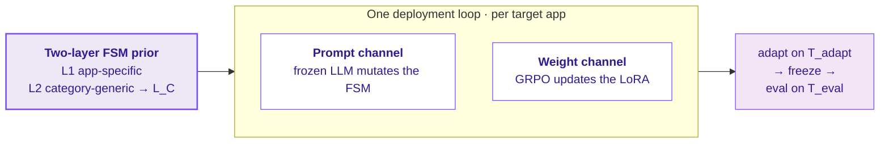

---
hide:
  - navigation
  - toc
---

# EvoFSM

Test-time adaptation for mobile GUI agents on **unseen apps**

Deployed to a new app, the agent adapts on a small budget by **jointly** evolving
a two-layer FSM prior (symbolic) and fine-tuning a LoRA policy (sub-symbolic),
reusing a per-category abstract-action library `L_C` learned during pretraining.

[Get started :material-arrow-right-thin:](method.md){ .md-button .md-button--primary }
[View on GitHub](https://github.com/pockyitachi/evofsm){ .md-button }

---

## The unseen-app gap

Mobile GUI agents are reliable on apps they were trained on but brittle on apps
they have never seen. Today's 60–80% benchmark numbers share train/test
templates — they say little about the deployment-relevant question: *when a user
installs a banking app, a niche notes tool, or a ride-hailing service the agent
has never encountered, can it become reliable from a handful of examples?*
EvoFSM targets exactly that unseen-app, small-budget regime.

## How it works

The **same loop** runs at source-pool pretraining and at target-app deployment,
which makes "test-time adaptation" a well-defined operation rather than an ad-hoc
fine-tune. See [Method](method.md) for the full picture.

## Explore

-   :material-sitemap-outline:{ .lg .middle } &nbsp; **Method**

    ---

    The two-layer FSM prior and the joint prompt + weight adaptation loop.

    [:octicons-arrow-right-24: Read the method](method.md)

-   :material-cellphone-check:{ .lg .middle } &nbsp; **Within-benchmark**

    ---

    AndroidWorld+ held-out apps: **B1 38.6 → B4 52.9** — symbolic +9.5, weight +4.8.

    [:octicons-arrow-right-24: See the study](within-benchmark.md)

-   :material-swap-horizontal-bold:{ .lg .middle } &nbsp; **Cross-benchmark**

    ---

    AndroidWorld+ → MobileWorld, two models — symbolic TTA vs the static prior.

    [:octicons-arrow-right-24: See the study](cross-benchmark.md)

-   :material-database-outline:{ .lg .middle } &nbsp; **Dataset & splits**

    ---

    Pool / category / template within a benchmark; category-level tiers across.

    [:octicons-arrow-right-24: Browse the splits](dataset.md)

!!! tip "Reproduce it"
    Environment, emulator boot, and the full B1→B4 / MobileWorld run commands are
    on the [Reproduce](reproduce.md) page.
