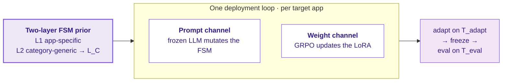

---
hide:
  - navigation
  - toc
---

# EvoFSM

面向移动 GUI 智能体在**未见过的 app** 上的测试时自适应

部署到一个新 app 后,智能体在小预算下**联合**演化一个两层 FSM 先验(符号层)并微调一个 LoRA 策略(子符号层)完成自适应,同时复用预训练阶段学到的、按类别组织的抽象动作库 `L_C`。

[开始使用 :material-arrow-right-thin:](method.md){ .md-button .md-button--primary }
[在 GitHub 查看](https://github.com/pockyitachi/evofsm){ .md-button }

---

## 未见过的 app 这道坎

移动 GUI 智能体在训练过的 app 上很可靠,在从未见过的 app 上却很脆弱。如今 60–80% 的基准数字共享训练/测试模板——它们对真正与部署相关的问题几乎没有回答:*当用户装上一个智能体从未遇到过的银行 app、小众笔记工具或网约车服务时,它能否凭几个示例就变得可靠?* EvoFSM 瞄准的正是这种未见过 app、小预算的场景。

## 工作原理

**同一个循环**既在源池预训练时运行,也在目标 app 部署时运行,这让"测试时自适应"成为一个定义清晰的操作,而不是临时的微调。完整图景见 [方法](method.md)。

## 浏览

-   :material-sitemap-outline:{ .lg .middle } &nbsp; **方法**

    ---

    两层 FSM 先验,以及联合的 prompt + 权重自适应循环。

    [:octicons-arrow-right-24: 阅读方法](method.md)

-   :material-cellphone-check:{ .lg .middle } &nbsp; **基准内**

    ---

    AndroidWorld+ 留出 app:**B1 38.6 → B4 52.9**,分别 +9.3 / +3.7。

    [:octicons-arrow-right-24: 查看研究](within-benchmark.md)

-   :material-swap-horizontal-bold:{ .lg .middle } &nbsp; **跨基准**

    ---

    AndroidWorld+ → MobileWorld,两个模型——符号 TTA 对比静态先验。

    [:octicons-arrow-right-24: 查看研究](cross-benchmark.md)

-   :material-database-outline:{ .lg .middle } &nbsp; **数据集与划分**

    ---

    单个基准内的 池 / 类别 / 模板;跨基准的类别级分层。

    [:octicons-arrow-right-24: 浏览划分](dataset.md)

!!! tip "复现"
    环境、模拟器启动,以及完整的 B1→B4 / MobileWorld 运行命令都在 [复现](reproduce.md) 页面。
