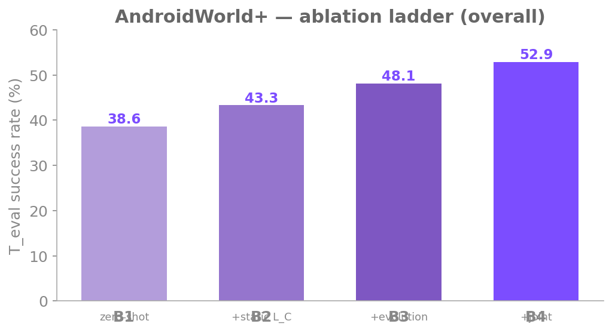

# Within-benchmark (AndroidWorld+)

The within-benchmark study asks the core test-time-adaptation (TTA) question on a
single benchmark: trained on a pool of source apps, how much better does the
agent get on **held-out apps of the same benchmark** when it adapts on a small
budget? It is the cleanest setting for isolating what each component of EvoFSM
contributes, because train and test apps come from one authoring process and
share the same task schema, action space, and scoring harness.

## Setup

**Benchmark.** AndroidWorld+ — Google's AndroidWorld extended with 6 apps from
BMOCA and AndroidLab, **25 apps** in total. The base agent is
Qwen3-VL-8B-Instruct driven by the M3A two-phase loop (per-step action selection
→ execute → per-step summary).

**Three disjoint splits.** Apps and task templates are partitioned so that
nothing seen during pretraining or adaptation reappears at evaluation:

| Split | Role | What it contains |
|---|---|---|
| **Pool** | Phase-1 pretraining | Source apps; their successful trajectories train the shared LoRA and seed the per-category library `L_C`. |
| **Category** | category structure | Play-Store-category grouping used to build and route `L_C` (one library per category). |
| **Template** | adaptation vs. evaluation | Per target app, the task templates are split into `T_adapt` (used to adapt) and a **template-disjoint** `T_eval` (used only to score). |

Target apps fall into two transfer tiers relative to the source pool:

- **Tier-B (near transfer)** — the target app's category *is* represented in the
  source pool, so a matching `L_C` exists.
- **Tier-C (far transfer)** — the target app's category is *not* in the pool. No
  `L_C` matches, so under static injection the prompt is byte-identical to the
  zero-shot baseline. **Tier-C is therefore a built-in null control** for the
  injection mechanism.

**Evaluation protocol (`T_eval`, K=3).** 35 frozen `T_eval` templates (Tier-B 18,
Tier-C 17) × **K=3 seeds** = **105 episodes** per arm. Success is AndroidWorld's
rule-based `is_successful(env)` at termination; a self-reported `status:complete`
does not count on its own.

## The ablation ladder

Four rungs, each adding one capability on top of the previous:

- **B1** — zero-shot base model. No FSM knowledge injected, no weights updated.
- **B2** — `+ static L_C`. The frozen per-category abstract-action library
  (aggregated from the source pool by Claude Opus) is injected into the
  action-selection prompt. FSM does not evolve; LoRA does not move.
- **B3** — `+ FSM evolution`. Starting from B2's static `L_C`, the library is
  mutated online on the target app's `T_adapt`, frozen, then evaluated. Weights
  still do not move.
- **B4** — `+ joint LoRA`. The full EvoFSM method: the evolved FSM **and** a
  per-app LoRA (initialized from the Phase-1 `π^pre`) are co-adapted on
  `T_adapt`, then frozen for `T_eval`.

{ width="620" }

| Rung | Method | Tier-B | Tier-C | **Overall (T_eval)** |
|---|---|:---:|:---:|:---:|
| **B1** | zero-shot Qwen3-VL-M3A | 47.2 | 29.4 | **38.6** |
| **B2** | + static category `L_C` | 56.5 | 29.4 | **43.3** |
| **B3** | + per-app FSM evolution | 63.9 | 31.4 | **48.1** |
| **B4** | + joint LoRA (per-tier `π^pre`) | 70.4 | 34.3 | **52.9** |

*(All numbers are mean success rate over 105 episodes; Tier-B n=54, Tier-C n=51
per arm.)*

### Deltas that carry the story

Read the ladder as two adaptation channels stacked on the zero-shot floor:

- **Symbolic channel — B1 → B3 = +9.5 pp overall** (38.6 → 48.1). Almost all of
  it lands in the **unseen-app** tier (Tier-B 47.2 → 63.9); far transfer barely
  moves. The split is causal, not incidental: on **Tier-C the static step
  B2 − B1 = +0.0 pp** — the null control fires exactly as designed, since with no
  matching `L_C` the B2 prompt is byte-identical to B1 and both arms converge to
  29.4%. So the gain tracks `L_C` *content*, not run conditions.
- **Weight channel — B3 → B4 = +4.8 pp overall** (48.1 → 52.9). On top of the
  evolved context, the per-tier `π^pre` LoRA co-adapted on `T_adapt` adds a
  further increment, lifting both tiers (Tier-B 63.9 → 70.4, Tier-C 31.4 → 34.3).

Both channels of the joint method contribute on AndroidWorld+ — the symbolic
channel the larger share, the weight channel a further increment on top.

### Where it helps

The aggregate gains concentrate in apps whose source-pool category had strong
structural overlap with the target:

- **`pro_expense` 33% → 67%** under B2 — driven by the Finance `L_C` (synthesized
  from `bluecoins`). Largest per-app jump in the static-injection sweep.
- **`system_settings` 75% → 92%** by B3 — the Tools `L_C` (from
  `calculator` / `clock` / `files`), then sharpened by evolution on the
  Wi-Fi/Bluetooth toggle `T_adapt` templates toward the exact verification
  patterns the `…Verify` templates need. This `+11.1 pp` is the single strongest
  B3 signal (largest-n Tier-B app, n=18).

The flip side is structural: a static library synthesized from list-view apps can
mis-fire on an app whose overview screen *looks* like a list but truncates its
content (the `simple_calendar_pro` month-view case), and some failures
(`chrome/Browser*` `open_app` hallucination, `camera` video-capture gesture
timing) live upstream of `L_C` entirely and neither symbolic nor weight
adaptation can fix them.

!!! note "What B4 = 52.9% is"
    B4 is the only rung where **both** channels are live. The headline combines
    all three adaptation surfaces — a per-tier `π^pre` LoRA initialization, the
    GRPO weight update, and the per-app evolved `L_C` — co-adapted on `T_adapt`
    and then frozen for the held-out `T_eval`. It sits at the top of the ladder
    at **52.9%**, +4.8 pp over the symbolic-only B3.

## Takeaways

1. **The symbolic prior does the work.** B1 → B2 → B3 is a clean, monotone climb
   (38.6 → 43.3 → 48.1), and Tier-C's flat null control gives us confidence the
   Tier-B gains are causal rather than noise.
2. **Static knowledge has a ceiling; evolution lifts it.** B2 is what a frozen,
   category-level library can buy; B3's `+3.7 pp` (concentrated on
   `system_settings`) is what online mutation recovers on top.
3. **The weight channel adds a further increment.** On top of the evolved
   context, joint LoRA (per-tier `π^pre`) lifts **B3 → B4 by +4.8 pp**
   (48.1 → 52.9), with both tiers moving up (Tier-B 63.9 → 70.4, Tier-C
   31.4 → 34.3). Whether the same weight channel surfaces under the harder
   cross-benchmark regime is taken up in the
   [Cross-benchmark](cross-benchmark.md) study.
4. **Read the per-app breakdown, not just the aggregate.** At K=3 the per-arm
   episode counts are small, so the large, consistent per-app jumps
   (`system_settings`, `pro_expense`) are the honest unit of reporting alongside
   the headline averages.
